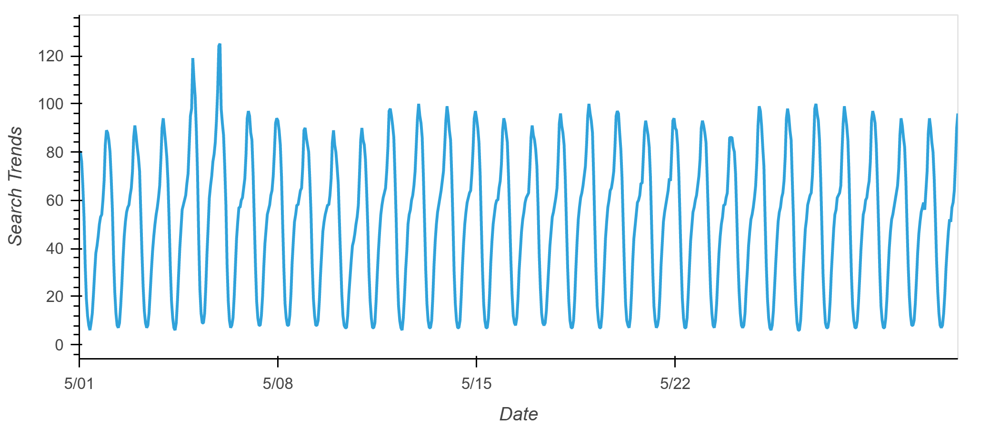
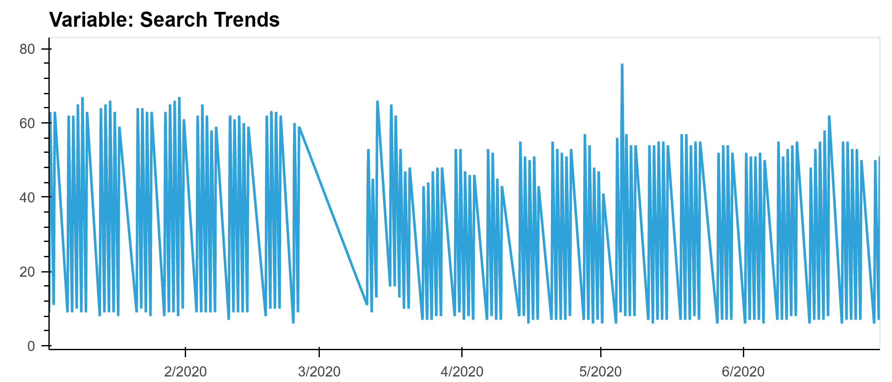
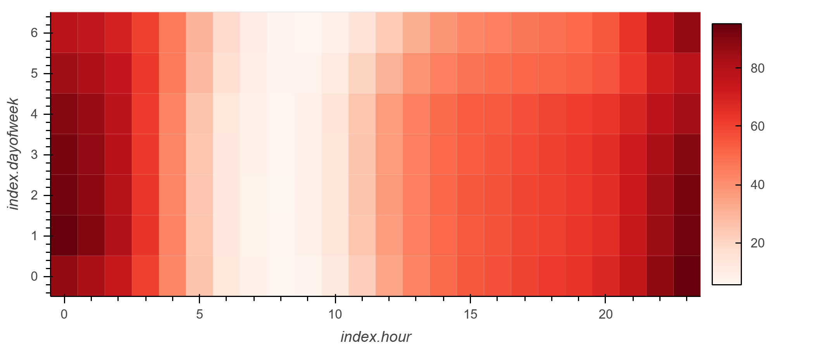
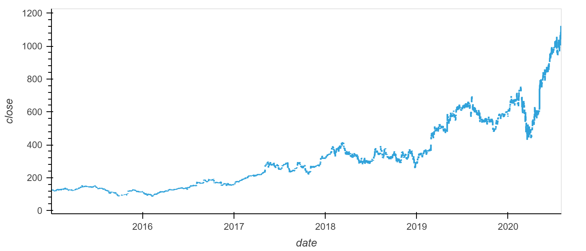
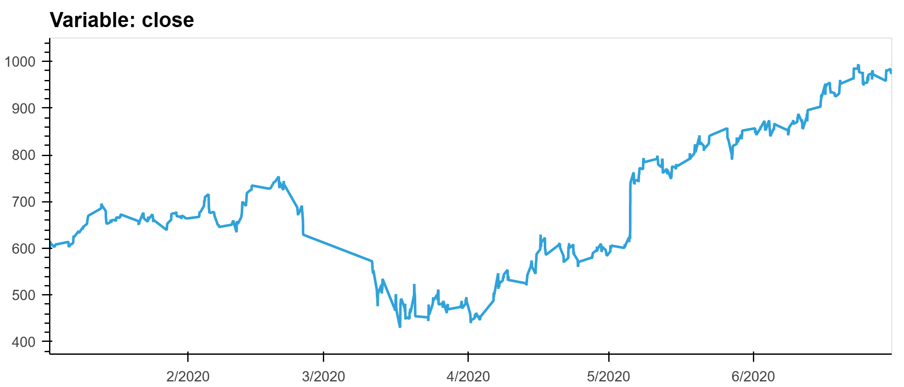
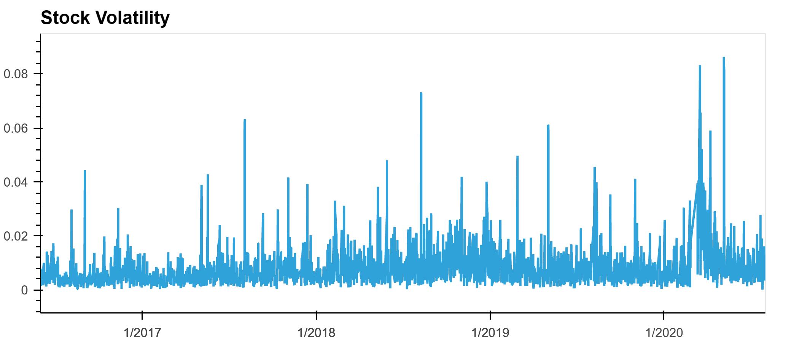
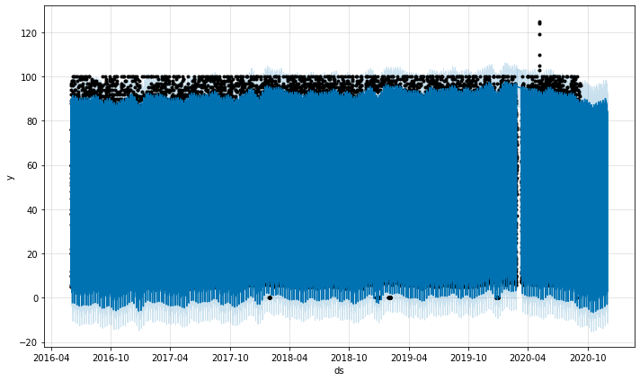
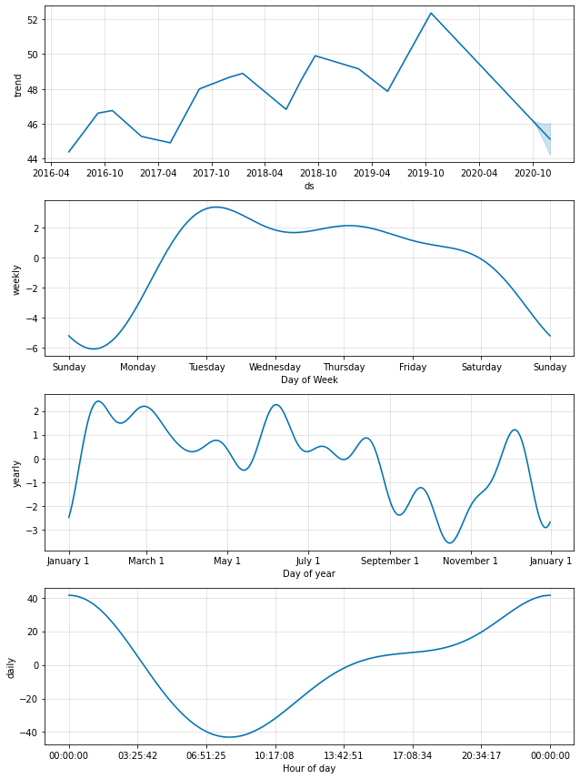

# Crypto Investment Forecasting with Unsupervised Machine Learning

This application provides a time series analysis performed by analyzing data from Google searches, and finding patterns based on existing financial data. Tool used is FB-prophet for unsupervised machine learning and forecast generation.

Rendering issues fixed by using NBVIEWER 
https://nbviewer.org/github/

### Files Imported
Financial performance data from "Mercado Libre" performance and google searches on the company.

    google_hourly_search_trends.csv
    mercado_daily_revenue.csv
    mercado_stock_price.csv

  
### Outputs
    1. Finds unusual patterns in hourly Google search traffic
    2. Mines the search traffic data for seasonality
    3. Relates the search trafic to stock price patterns
    4. Creates a time series model with Prophet
    5. Forecasts revenu using time series models 
---
## Technologies

    Phyton Version: **3.7.13**

## Libraries and Dependencies

### hvplot
[hvplot](https://holoviz.org/tutorial/Composing_Plots.html)

### phrophet
[phrophet](https://pypi.org/project/fbprophet/)

### holoviews
[holoviews](https://holoviews.org/) 

### pystan
[pystan](https://pystan.readthedocs.io/en/latest/)

### pandas
[pandas](https://pandas.pydata.org/)

### matplotlib
[matplotlib](https://matplotlib.org/)

---
## How to run
1. Install required libraries and dependencies

            !pip install prophet
            !pip install hvplot
            !pip install holoviews
            !pip install pystan
2. Before running code make sure these libraries can run

            import pandas as pd
            from pathlib import Path
            import holoviews as hv
            from prophet import Prophet
            import hvplot.pandas
            import datetime as dt
            %matplotlib inline
            from google.colab import files

3. Clone the repository and run the file with Jupyter

------
## DEMO including screenshots

### Google searches - May 2020

### Google searches focused half of the year

### Heatmap of Google searches by day and hour

### Stock close price over time

### Stock close focused hafl of the year:

### Plot of volatility over time:

### Plot of Forecast by Prophet:

### Forecast composite plot by trend , week , day and year

---
<!--Contributors -->
## Contributors
  Startup code provded by UW FinTech Bootcamp program.

## License
Tool is available under an MIT License.

---

## Aknowledgements
* [Markdown Guide](https://www.markdownguide.org/basic-syntax/#reference-style-links)
